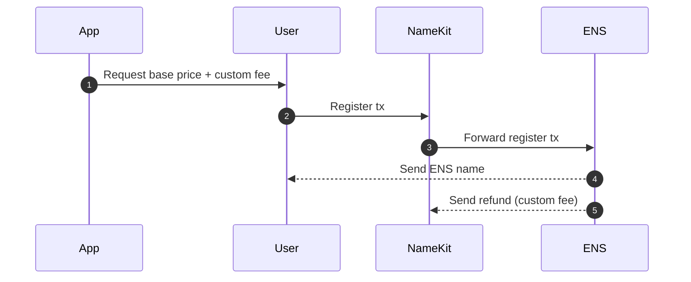

# NameKit contracts
- [NameKit contracts](#namekit-contracts)
  - [How it works?](#how-it-works)
  - [Getting started](#getting-started)
    - [Required](#required)
    - [Deploying your contracts](#deploying-your-contracts)
  - [Commands](#commands)
    - [For registering a name through](#for-registering-a-name-through)
    - [For withdrawing collected fees](#for-withdrawing-collected-fees)
  - [Contracts deployed](#contracts-deployed)
    - [Mainnet](#mainnet)
    - [Sepolia](#sepolia)
  - [License](#license)

## How it works?
This project is one of many components of NameKit. The goal of this contract template is helping ENS grow by incentivizing more wallets and apps to promote ENS name registration and renewal to their users. The contract enables those wallets & apps to define a custom price premium on top of the base rate for .eth names. This enables the creation of recurring revenue streams for builders who help ENS grow. We hope this creates more incentives for wallets & apps to onboard their users into ENS.

Each wallet and app should deploy their own instance of this contract that defines their specialized treasury address.

This contract only works for the registration and renewal of direct subnames of ".eth".

The contract is designed and optimized to spend as little gas overhead as possible. Users pay a little more for the app to have this revenue opportunity.



1. The app gets the base price of the desired ".eth" name and adds their customized price premium. The app then requests this total value in the registration transaction to be approved by the user.
2. The user approves the transaction, interacting with app's custom deployment of the NameKit Controller contract.
3. The app's custom deployment of the NameKit Controller forwards the transaction to ETHRegistrarController with all the user-provided parameters.
4. ETHRegistrarController sends the ENS name NFT to the user.
5. The app's custom deployment of the NameKit Controller accrues their customized price premium, which can be withdrawn to their custom treasury address whenever desired.


## Getting started

### Required
- Node and Yarn, to run the scripts
- Infura API key, to deploy and interact with contracts
- Etherscan API key, to verify contracts


### Deploying your contracts
1. Install all the dependencies with [Node](https://nodejs.org/en/download/) and Yarn.
   ```
   yarn
   ```

2. Copy the `sample.env` file and rename it to `.env`, then complete all missing variables.
3.  If having the same contract address in testnet and mainnet is important to you, then the following steps are needed.
    1.  Same treasury address across networks. 
        -  If it's an EOA (address that comes from private key), no worries. 
        -  If you want a Safe Multisig, then create your treasury [here](https://smold.app/safe).
    2. The deployer private key must be a fresh account, with zero transactions. Make sure to send some ETH to this account in order to pay for fees on contract deployment.
4. Deploying contracts
   - Sepolia
   ```
   yarn deploy:test
   ```
   - Mainnet
   ```
   yarn deploy:mainnet
   ```
5. Fork this repo and change the NamekitController and treasury addresses on README, for internal documentation.

🎉 Congrats, now you have a new way to generate revenue!!

## Commands
Before running these commands, make sure to:
- Generate the typechain interfaces: `yarn compile`
- Change CHAIN_ID in `.env` to the desired network you want to interact with. 1 = Mainnet, 11155111 = Sepolia.

### For registering a name through
- Make sure to fill the environment variables
  - PLATFORM_URL: For making your registrations to count on [ENSIP-14](https://docs.ens.domains/ens-improvement-proposals/ensip-14-platform-source-parameter) standard.
  - NAME_TO_REGISTER
```
yarn register-name
```

### For withdrawing collected fees
```
yarn withdraw
```
  
## Contracts deployed

### Mainnet
- [Example NamekitController](https://etherscan.io/address/0x232332263e6e4bd8a134b238975e2200c8b7dac1#code): `0x232332263e6e4bd8a134b238975e2200c8b7dac1`
- [Example NameKit Treasury](https://etherscan.io/address/0xC362EB2dDCde1866b263fF59778c0a6eF69eF4F3#code): `0xC362EB2dDCde1866b263fF59778c0a6eF69eF4F3`
- [ENS ETHRegistrarController](https://etherscan.io/address/0x253553366Da8546fC250F225fe3d25d0C782303b#code): `0x253553366Da8546fC250F225fe3d25d0C782303b`
- [ENS Public resolver](https://etherscan.io/address/0x4976fb03C32e5B8cfe2b6cCB31c09Ba78EBaBa41#code): `0x4976fb03C32e5B8cfe2b6cCB31c09Ba78EBaBa41`
- [ENS Registry with fallback](https://etherscan.io/address/0x00000000000C2E074eC69A0dFb2997BA6C7d2e1e#code): `0x00000000000C2E074eC69A0dFb2997BA6C7d2e1e`
- [Chainlink ETH/USD data feed](https://etherscan.io/address/0x5f4eC3Df9cbd43714FE2740f5E3616155c5b8419#code) `0x5f4eC3Df9cbd43714FE2740f5E3616155c5b8419`

### Sepolia
- [Example NamekitController](https://sepolia.etherscan.io/address/0x1cf7735B2e2641274f6d038701c561010D2fCf46#code): `0x1cf7735B2e2641274f6d038701c561010D2fCf46`
- [Example NameKit Treasury](https://sepolia.etherscan.io/address/0xb3C70b0FEeFfE0F3a540514C8080147c296982d3#code): `0xb3C70b0FEeFfE0F3a540514C8080147c296982d3`
- [ENS ETHRegistrarController](https://sepolia.etherscan.io/address/0xFED6a969AaA60E4961FCD3EBF1A2e8913ac65B72#code): `0xFED6a969AaA60E4961FCD3EBF1A2e8913ac65B72`
- [ENS Public resolver](https://sepolia.etherscan.io/address/0x8FADE66B79cC9f707aB26799354482EB93a5B7dD#code): `0x8FADE66B79cC9f707aB26799354482EB93a5B7dD`
- [ENS Registry with fallback](https://sepolia.etherscan.io/address/0x00000000000C2E074eC69A0dFb2997BA6C7d2e1e#code): `0x00000000000C2E074eC69A0dFb2997BA6C7d2e1e`
- [Chainlink ETH/USD data feed](https://sepolia.etherscan.io/address/0x694AA1769357215DE4FAC081bf1f309aDC325306#code): `0x694AA1769357215DE4FAC081bf1f309aDC325306`

_ABIs are avaiable on Etherscan_

## License

Licensed under the MIT License, Copyright © 2023-present [NameHash Labs](https://namehashlabs.org).

See [LICENSE](./LICENSE) for more information.
